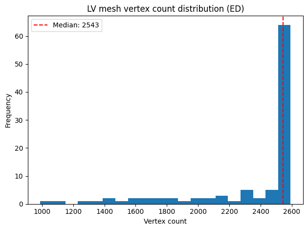
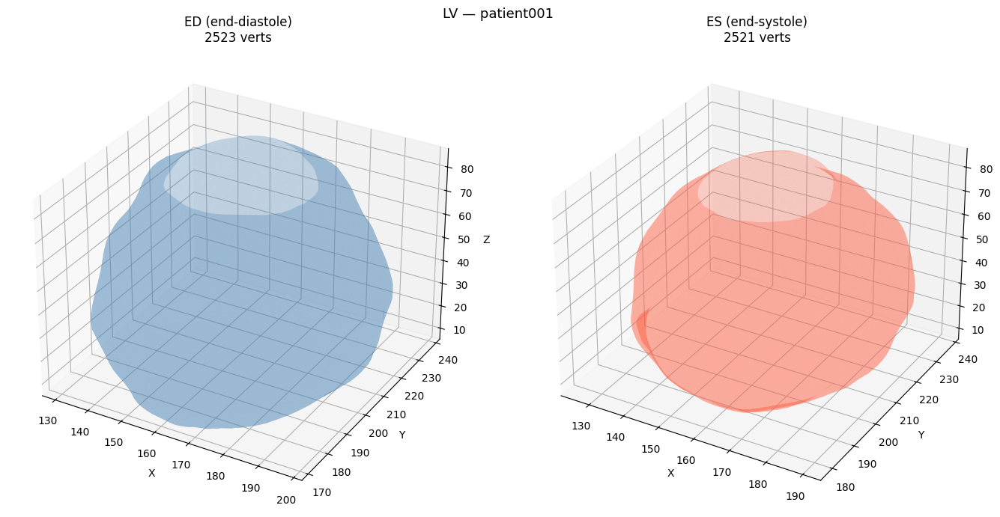

# ACDC Cardiac Shape Generation

SE(3)-equivariant generative model for left-ventricular (LV) surface meshes,
trained on the [ACDC dataset](https://www.creatis.insa-lyon.fr/Challenge/acdc/).
The model combines a VAE encoder (EGNN backbone) with conditional optimal-transport
flow matching to generate realistic, anatomically plausible cardiac shapes.

## Figures

### LV Mesh Vertex Count Distribution


### ED vs ES Comparison


## Data

**Source:** ACDC (Automated Cardiac Diagnosis Challenge) — 100 subjects, 5
pathology classes (normal, DCM, HCM, MINF, RV).

**Preprocessing pipeline:**

```
data/raw/           → DICOM / NIfTI volumes
data/meshes/        → surface meshes extracted per subject/frame
data/registered/    → meshes registered to a common template (*.ply)
data/graphs/        → PyG graphs  (pos, edge_index, face)
data/graphs_curvature/ → graphs + curvature node features
```

Each graph node corresponds to a mesh vertex. Edges are built from the mesh
face connectivity. Node features are computed by
[libigl](https://libigl.github.io/libigl-python-bindings/) `principal_curvature`:

| Feature | Description |
|---------|-------------|
| `k1` | Max principal curvature |
| `k2` | Min principal curvature |
| `H`  | Mean curvature `(k1+k2)/2` |
| `K`  | Gaussian curvature `k1*k2` |
| `χ`  | Handedness pseudoscalar `sign((pd1×pd2)·n)` |
| `pd1` | Max-curvature eigenvector (V,3), stored as `data.principal_dir1` |
| `pd2` | Min-curvature eigenvector (V,3), stored as `data.principal_dir2` |

**Rebuild curvature graphs** (required for X-EGNN; takes ~5 min):
```bash
python scripts/build_curvature_batch.py
```

## Models

### EGNN (baseline)
Standard SE(3)-equivariant GNN ([Satorras et al., 2021](https://arxiv.org/abs/2102.09844)).
Isotropic message passing: edges weighted by pairwise distance only.
- `src/models/egnn.py`, `src/models/encoder.py`
- Config: `configs/main_model.yaml`

### Gauge-EGNN
Augments EGNN with a **learned anisotropy frame** derived from scalar curvature
features. A per-node equivariant frame vector `d_i` is constructed as a learned
weighted sum of unit edge directions; a per-edge weight `w_ij` measures alignment
of each edge with `d_i`, modulating message magnitude before aggregation.
- `src/models/gauge_egnn.py`, `src/models/gauge_encoder.py`
- Config: `configs/gauge_model.yaml`

### X-EGNN (Explicit Eigenvector EGNN)
Replaces the learned proxy frame with the **exact principal-curvature
eigenvectors** `(pd1_i, pd2_i)` from libigl. Provides a full 2-D anisotropic
frame with three independent equivariant coordinate-update contributions:
along the edge direction, along the max-curvature direction, and along the
min-curvature direction.
- `src/models/x_egnn.py`, `src/models/x_encoder.py`
- Config: `configs/x_egnn_model.yaml`
- **Requires rebuilt curvature graphs** (see above)

## Results

All metrics on LV end-diastole validation set.
1-NNA: closer to 0.5 is better (0.5 = indistinguishable from real, 1.0 = mode collapse).

### Reconstruction

| Model | Chamfer (mm) ↓ | Hausdorff (mm) ↓ |
|-------|---------------|-----------------|
| PCA baseline | 8.40 ± 1.04 | 32.43 ± 1.12 |
| MLP flow matching (non-equivariant) | 1.060 ± 0.075 | 1.717 ± 0.099 |
| **EGNN (ours)** | **0.995 ± 0.077** | **1.614 ± 0.100** |
| Gauge-EGNN + KL warmup | 1.004 ± 0.074 | 1.627 ± 0.097 |
| Gauge-EGNN + geo/attn pool | 1.028 ± 0.077 | 1.694 ± 0.099 |
### Generation & Clinical

| Model | 1-NNA ↓ | Probe (%) ↑ | EF error (%) ↓ |
|-------|---------|------------|----------------|
| MLP flow matching | 0.605 | 31 | — |
| EGNN (ours) | 0.605 | 32 | 230 |
| Gauge-EGNN + KL warmup | **0.590** | 38 | **157** |
| Gauge-EGNN + geo/attn pool | 0.600 | **41** | 281 |

- **1-NNA**: how realistic generated shapes look — 0.5 is perfect, 1.0 is bad. All models are around 0.59–0.61, so generation quality is similar across the board.
- **Probe**: how well the latent space separates the 5 cardiac pathologies (random chance = 20%). Higher is better. The Gauge-EGNN variants improve this significantly, with geo/attn pool reaching 41%.
- **EF error**: how accurate the generated heart volumes are clinically. All models are poor, but Gauge-EGNN + KL warmup (157%) is notably better than the 230% EGNN baseline.

Gauge-EGNN + KL warmup is the best overall — best generation realism and best clinical accuracy. The geo/attn pool variant has the most structured latent space (probe=41%) but sacrifices EF accuracy.

## Training

```bash
# EGNN baseline
python -m src.training.train_main --config configs/main_model.yaml

# Gauge-EGNN
python -m src.training.train_gauge --config configs/gauge_model.yaml \
  --set kl_weight=0.005 kl_anneal_epochs=50

# X-EGNN (after rebuilding curvature graphs with in_node_dim=5)
python -m src.training.train_x_egnn --config configs/x_egnn_model.yaml \
  --set in_node_dim=5
```

Override any config key with `--set KEY=VALUE`. Each run gets its own
`out_dir` and `wandb_run_name`.

## Evaluation

```bash
python -m src.evaluation.eval_reconstruction
python -m src.evaluation.eval_generation
python -m src.evaluation.eval_clinical
```

Results are written to `results/`.

## Environment

```bash
source /workspace/envs/acdc/bin/activate
```

Key deps: PyTorch 2.6, torch_geometric, libigl, trimesh, wandb, scikit-learn.
